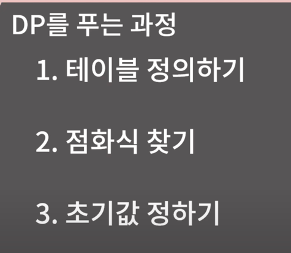

DP 는 문제를 많이 풀어봐야 한다.

다이나믹 프로그래밍
: 여러 개의 하위 문제를 먼저 푼후 그 결과를 쌓아올려 주어진 문제를 해결하는 알고리즘

문제를 해결하기 위한 점화식을 구한 뒤에 푸는 것

가장 대표적인 것인 피보나치 수열
```java
int fibo(int n) {
    if(n <=1) return 1;
    return fibo(n-1) + fibo(n-2);
}
```

```java
int fibo(int n) {
    if(n <=1) return 1;
    return fibo(n-1) + fibo(n-2);
}
```

중간 결과를 기억해서 푸는지 안푸는지.

1. 테이블 정의하기.
2. 점화식 찾기.
3. 초기값 정하기.

어떻게 풀지?

1. 직접 테이블을 채워보자.
2.  
