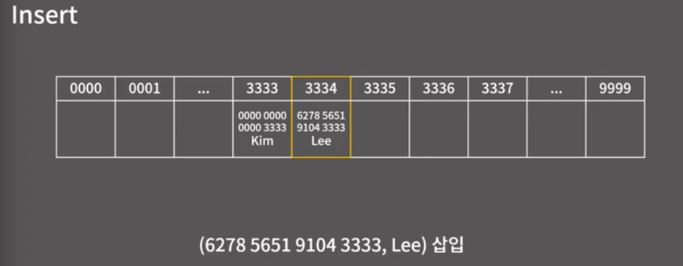

# 정의와 성질

이 상황에서 카드를 어떻게 알 수 있는가?

해시 자료구조는 키에 대응되는 값을 저장하는 것.

모든게 O(1)

키에 대응되는 값을 저장하는 자료구조이다.

그럼 어떻게 O(1) 일까?

해시 테이블때문에 O(1)이라 말할 수 있다.

## 충돌 회피 1 - Chaining

서로 다른 키가 같은 해시값을 가질 경우 충돌이라 할 수 있다.

함수의 입력이 주어지는 정의역의 공간이 너무 커서 이것을 바로 인덱스 할용할 수 없으니 범위를 줄이고자 하는 데에 있어요.
이를테면 카드 번호의 종류는 10^16개이지만 뒷 4자리만 이용해서 10^4로 줄인 것처럼!

충돌회피 방법에 대해서

Chaining 과 Open Addressing

**Chaining**

같은 Hash 값이 나올 경우에 체이닝을 한다.

충돌이 빈번하게 되면 O(n)의 속도를 가지게 됩니다.

**Open Addressing**

그 다음으로는

일치하는 카드를 찾을 때까지 찾는다.

제거할 경우에는 있었는데, 없어졌다는 표시를 남긴다.

Linear Probing

탐사적이다. 스타의 프로브랑 같은 이야기.

Quadratic Probing

Double Hashing

