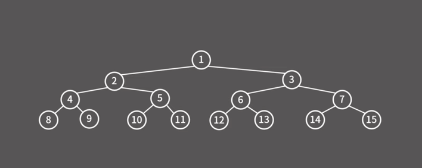
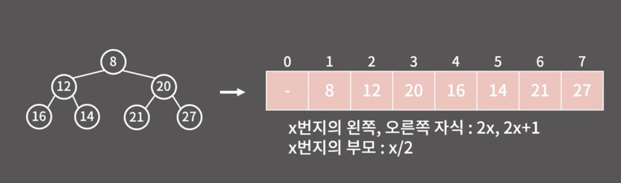

# 우선순위 큐

pop을 할 때 가장 먼저 들어온 원소가 나오는 대신 우선순위가 가장 높은 원소가 나오는 큐

1. 원소의 추가가 O(logN)
2. 우선순위가 가장 높은 원소의 확인이 O(1)
3. 우선순위가 가장 높은 원소의 제거가 O(longN)

Heap 이라는 자료구조를 사용하면 되는데

Heap 이란 무엇인가?

이진 트리의 모형을 가진다.

정적의 자식이 최대 2개를 가지는 것.

최대 힙, 최솟값을 찾기 위해 찾는 것이 최소 힙

최소 힙의 경우.

1. 부모가 자식보다 작아야 한다.
2. 왼쪽은 오른쪽보다 작다.

